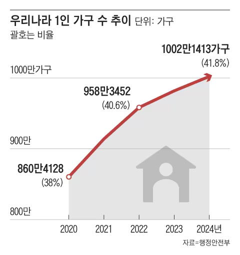

# 프로젝트 소개

### Spaces in Space

**Space in Space 개요:**

**'Spaces in Space' 는 ‘공간 안에 공간들’이라는 컨셉으로 1인 가구를 위한 고급스러우면서도 가성비 좋은 맞춤형 가구를 선보이는 온라인 쇼핑몰이며, 작은 공간에서도 세련된 분위기와 실용성을 제공한다.**

**사이트 주요 기능:**

- 가구 종류별로 편리하게 조회
- 회원 가입 후 장바구니 추가, 구매하기
- 1:1 문의하기
- 상품별 리뷰 작성
- FAQ(공지) 조회

# 시장조사

✍️ **1인 가구 정의** : “ 1인가구"라 함은 1명이 단독으로 생계를 유지하고 있는 생활 단위를 말한다. ( 건강가정기본법)

**통계를 보면서 알 수 있듯이 1인 가구는 10명중 4명** 
**2024년 3월 부로 1인 가구의 세대 수가 1 천 만을 넘어섰다.**

- **1, 2인 가구가 기대하고 있는 주거 환경 인사이트**
    
    1) 본인의 **취향이 담길 공간**
    2) **라이프스타일에 맞춰 공간 최적화**
    3) **깔끔하고 쾌적한 집**
    
- 요즘의 1~2인 가구는 주거비가 부담된다고 해서 무조건적인 다운사이징을 추구하진 않는다. 면적이 좁더라도 합리적으로 활용이 가능한, 이른바 ‘핏사이징’ 공간을 지향한다. 핏사이징이란 불필요하게 큰 집의 사이즈를 줄이고 알맞은 주거 생활의 규모를 정립하는 행동을 뜻한다.

-집이라는 공간은 자기 자신을 한껏 드러낼 수 있는 공간이다.  집이 갖는 ‘공간력’의 의미가 중요해지고 있다.
출처: https://beyondapartment.kr/12인-가구의-슬기로운-주거-생활/

# 주요 기능
    
## 사용자

### 로그인(feat/auth)

| 로그인 | 아이디, 비밀번호 입력 후 로그인 |
| --- | --- |
| 아이디 찾기 | 연락처로 아이디 찾기 |

### 개인 정보(feat/member-user)

| 개인 정보 조회 | 본인 정보 조회 |
| --- | --- |
| 개인 정보 수정 | 본인 개인 정보 수정 |
| 회원 탈퇴 | 본인 계정 탈퇴 |
| 회원 가입 | 본인 회원 가입 |

### 상품(feat/product-user)

| 상품 전체 조회 | 전체 판매 상품 조회 |
| --- | --- |
| 상품 카테고리별 조회 | 카테고리별 판매 상품 조회 |
| 상품 상세 조회 | 1개 상품 정보 조회 |

### 장바구니(feat/cart-user)

| 장바구니 전체 조회 | 전체 내역 조회 |
| --- | --- |
| 장바구니 수정 | n개 내역 수정 |
| 장바구니 삭제 | n개 내역 선택 후 삭제 |
| 장바구니 추가 | 내역 1개 추가 |

### 결제(feat/pay-user)

| 상품 결제 | 해당 상품  결제 |
| --- | --- |
| 장바구니 결제 | 장바구니 상품 결제 |
| 전체 결제 내역 조회 | 전체 결제 내역 조회 |
| 단일 결제 내역 조회 | 단일 결제 내역 조회 |
| 결제 취소 | 결제 취소 |

### 리뷰(feat/review-user)

| 리뷰 작성 | 주문 1건에 대하여 리뷰 작성 |
| --- | --- |
| 리뷰 수정 | 리뷰 1건 수정 |
| 리뷰 삭제 | 리뷰 1건 삭제 |
| 리뷰 조회 | 사용자가 남긴 리뷰 조회 |

### 문의(feat/inquiry-user)

| 문의 추가 | 문의 1개 작성 |
| --- | --- |
| 문의 수정 | 본인이 남긴 상품 문의 1개 수정 |
| 문의 삭제 | 본인이 남긴 상품 문의 1개 삭제 |
| 문의 전체 조회 | 본인이 남긴 문의 전체 조회 |
| 문의 상세 조회 | 본인이 남긴 문의 1개 조회 |

## 관리자

### 회원 관리(feat/member-admin)

| 회원 전체 조회 | 전체 회원 리스트 조회 |
| --- | --- |
| 회원 상세 조회 | 1명 회원의 상세 정보 조회 |
| 회원 정보 수정 | 1명 회원의 상세 정보 수정 |
| 회원 탈퇴 | 1명 회원 탈퇴 |
| 관리자 로그인 | 아이디, 비밀번호 입력 후 로그인 |

### 상품 관리(feat/product-admin)

| 상품 전체 조회 | 전체 판매 상품 조회 |
| --- | --- |
| 상품 카테고리별 조회 | 카테고리별 판매 상품 조회 |
| 상품 상세 조회 | 1개 상품 정보 조회 |
| 상품 등록 | 1개 상품 추가 |
| 상품 수정 | 1개 상품에 대하여 수정 |
| 상품 삭제 | n개 상품에 대하여 삭제 |

### 결제 관리(feat/pay-admin)

| 결제 전체 조회 | 전체 결제건 조회 |
| --- | --- |
| 결제 상세 조회 | 결제 1건 조회 |
| 결제 검색 | 결제 검색 |
| 결제 취소 | 결제 1건 취소 |

### 문의 관리(feat/inquiry-admin)

| 문의 전체 조회 | 문의 전체 조회 |
| --- | --- |
| 문의 상세 조회 | 문의 1건 상세 조회 |
| 문의 답변 추가 | 문의 1건에 대하여 답변 |
| 문의 답변 수정 | 문의 1건에 대한 답변 수정 |
| 문의 답변 삭제 | 문의 1건에 대한 답변 삭제 |
| 문의 답변 조회 | 문의 1건에 대한 답변 조회 |

### FAQ 관리(feat/faq-admin)

| FAQ 전체 조회 | FAQ 리스트 전체 조회 |
| --- | --- |
| FAQ 추가 | 1개 FAQ 추가 |
| FAQ 수정 | 1개 FAQ 수정 |
| FAQ 삭제 | 1개 FAQ 삭제 |

# 논리 데이터 베이스 모델 (ERD)

.png)
